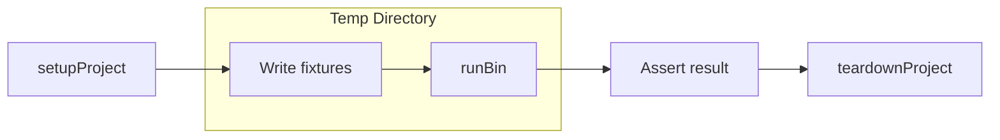

# @scalvert/bin-tester


[](https://badge.fury.io/js/%40scalvert%2Fbin-tester)
[](https://github.com/scalvert/bin-tester/blob/master/package.json)


[](#badge)

A test harness for Node.js CLI tools. Run your CLI against real temporary projects with isolated fixtures, then assert on the output.

## Why?

Testing CLI tools is hard. You need to:
- Create realistic project fixtures for each test
- Run your CLI as a subprocess against those fixtures
- Capture stdout/stderr and exit codes
- Clean up temp directories after each test
- Debug failures when something goes wrong

**bin-tester** handles all of this, letting you focus on writing tests.

## Quickstart

```bash
npm add @scalvert/bin-tester --save-dev
```

```ts
import { createBinTester } from '@scalvert/bin-tester';
import { describe, test, expect, beforeEach, afterEach } from 'vitest';

describe('my-cli', () => {
  const { setupProject, teardownProject, runBin } = createBinTester({
    binPath: './bin/my-cli.js',
  });

  let project;

  beforeEach(async () => {
    project = await setupProject();
  });

  afterEach(() => {
    teardownProject();
  });

  test('outputs version', async () => {
    const result = await runBin('--version');
    expect(result.stdout).toContain('1.0.0');
  });

  test('processes files', async () => {
    // Create files in the temp project
    project.files = {
      'src/index.js': 'console.log("hello");',
    };
    await project.write();

    const result = await runBin('src/index.js');
    expect(result.exitCode).toBe(0);
  });
});
```

## How it works

bin-tester creates an isolated temp directory for each test, runs your CLI as a child process, and captures the result. After each test, the temp directory is cleaned up automatically.



## Full example

```js
import { createBinTester } from '@scalvert/bin-tester';

describe('my-cli', () => {
  let project;
  const { setupProject, teardownProject, runBin } = createBinTester({
    binPath: 'node_modules/.bin/my-cli',
    staticArgs: ['--config', 'test.config.js'], // args passed to every invocation
  });

  beforeEach(async () => {
    project = await setupProject();
  });

  afterEach(() => {
    teardownProject();
  });

  test('basic invocation', async () => {
    const result = await runBin();
    expect(result.stdout).toBe('Done');
  });

  test('with fixture files', async () => {
    // Write files to the temp project
    project.files = {
      'src/index.js': 'export default 42;',
      'package.json': JSON.stringify({ name: 'test-project' }),
    };
    await project.write();

    // Run CLI with additional args
    const result = await runBin('--input', 'src/index.js');

    expect(result.exitCode).toBe(0);
    expect(result.stdout).toContain('Processed');
  });

  test('handles errors', async () => {
    const result = await runBin('--invalid-flag');

    expect(result.exitCode).toBe(1);
    expect(result.stderr).toContain('Unknown flag');
  });
});
```

## Debugging

bin-tester provides first-class debugging support for CLI tools. Enable debugging explicitly via environment variables or the `runBinDebug()` helper.

### Environment variables

```bash
# Enable inspector (attach mode) and preserve fixtures
BIN_TESTER_DEBUG=attach npm test

# Break on first line of bin and preserve fixtures
BIN_TESTER_DEBUG=break npm test
```

When debugging is enabled, bin-tester enables the Node inspector and preserves fixtures for inspection:
```
[bin-tester] Debugging enabled. Fixture: /tmp/tmp-abc123
[bin-tester] Fixture preserved: /tmp/tmp-abc123
```

### Programmatic debugging

Use `runBinDebug()` to enable debugging for a single invocation:

```ts
import { createBinTester } from '@scalvert/bin-tester';

const { setupProject, teardownProject, runBinDebug } = createBinTester({
  binPath: 'node_modules/.bin/your-cli',
});

const project = await setupProject();
await runBinDebug('--some-flag'); // Runs with --inspect=0
teardownProject();
```

### VS Code Setup

Add this to your `.vscode/launch.json`:

```jsonc
{
  "version": "0.2.0",
  "configurations": [
    {
      "name": "Debug Tests",
      "type": "node",
      "request": "launch",
      "runtimeExecutable": "${workspaceFolder}/node_modules/.bin/vitest",
      "runtimeArgs": ["run"],
      "autoAttachChildProcesses": true,
      "skipFiles": ["<node_internals>/**"],
      "console": "integratedTerminal"
    },
    {
      "name": "Debug Current Test File",
      "type": "node",
      "request": "launch",
      "runtimeExecutable": "${workspaceFolder}/node_modules/.bin/vitest",
      "runtimeArgs": ["run", "${relativeFile}"],
      "autoAttachChildProcesses": true,
      "skipFiles": ["<node_internals>/**"],
      "console": "integratedTerminal"
    }
  ]
}
```

> **Note:** Replace `vitest` with your test runner (`jest`, `mocha`, etc.) as needed.

The key setting is `"autoAttachChildProcesses": true` — this tells VS Code to attach to child processes spawned by bin-tester. Use `runBinDebug()` or set `BIN_TESTER_DEBUG=attach` in your test to enable the inspector.

**Alternative: JavaScript Debug Terminal**

Open the command palette (`Cmd+Shift+P`) → "Debug: JavaScript Debug Terminal" → run your tests with `BIN_TESTER_DEBUG=attach`.

## API

<!--DOCS_START-->
## Classes

<dl>
<dt><a href="#BinTesterProject">BinTesterProject</a></dt>
<dd></dd>
</dl>

## Functions

<dl>
<dt><a href="#createBinTester">createBinTester(options)</a> ⇒ <code>CreateBinTesterResult.&lt;TProject&gt;</code></dt>
<dd><p>Creates the bin tester API functions to use within tests.</p></dd>
</dl>

<a name="BinTesterProject"></a>

## BinTesterProject
**Kind**: global class  

* [BinTesterProject](#BinTesterProject)
    * [new BinTesterProject(name, version, cb)](#new_BinTesterProject_new)
    * [.gitInit()](#BinTesterProject+gitInit) ⇒ <code>\*</code>
    * [.chdir()](#BinTesterProject+chdir)
    * [.dispose()](#BinTesterProject+dispose) ⇒ <code>void</code>

<a name="new_BinTesterProject_new"></a>

### new BinTesterProject(name, version, cb)
<p>Constructs an instance of a BinTesterProject.</p>


| Param | Type | Default | Description |
| --- | --- | --- | --- |
| name | <code>string</code> | <code>&quot;fake-project&quot;</code> | <p>The name of the project. Used within the package.json as the name property.</p> |
| version | <code>string</code> |  | <p>The version of the project. Used within the package.json as the version property.</p> |
| cb | <code>function</code> |  | <p>An optional callback for additional setup steps after the project is constructed.</p> |

<a name="BinTesterProject+gitInit"></a>

### binTesterProject.gitInit() ⇒ <code>\*</code>
<p>Runs <code>git init</code> inside a project.</p>

**Kind**: instance method of [<code>BinTesterProject</code>](#BinTesterProject)  
**Returns**: <code>\*</code> - <p>{execa.ExecaChildProcess<string>}</p>  
<a name="BinTesterProject+chdir"></a>

### binTesterProject.chdir()
<p>Changes a directory from inside the project.</p>

**Kind**: instance method of [<code>BinTesterProject</code>](#BinTesterProject)  
<a name="BinTesterProject+dispose"></a>

### binTesterProject.dispose() ⇒ <code>void</code>
<p>Correctly disposes of the project, observing when the directory has been changed.</p>

**Kind**: instance method of [<code>BinTesterProject</code>](#BinTesterProject)  
<a name="createBinTester"></a>

## createBinTester(options) ⇒ <code>CreateBinTesterResult.&lt;TProject&gt;</code>
<p>Creates the bin tester API functions to use within tests.</p>

**Kind**: global function  
**Returns**: <code>CreateBinTesterResult.&lt;TProject&gt;</code> - <ul>
<li>A project instance.</li>
</ul>  

| Param | Type | Description |
| --- | --- | --- |
| options | <code>BinTesterOptions.&lt;TProject&gt;</code> | <p>An object of bin tester options</p> |


* [createBinTester(options)](#createBinTester) ⇒ <code>CreateBinTesterResult.&lt;TProject&gt;</code>
    * [~runBin(...args)](#createBinTester..runBin) ⇒ <code>execa.ExecaChildProcess.&lt;string&gt;</code>
    * [~setupProject()](#createBinTester..setupProject)
    * [~setupTmpDir()](#createBinTester..setupTmpDir)
    * [~teardownProject()](#createBinTester..teardownProject)

<a name="createBinTester..runBin"></a>

### createBinTester~runBin(...args) ⇒ <code>execa.ExecaChildProcess.&lt;string&gt;</code>
**Kind**: inner method of [<code>createBinTester</code>](#createBinTester)  
**Returns**: <code>execa.ExecaChildProcess.&lt;string&gt;</code> - <p>An instance of execa's child process.</p>  

| Param | Type | Description |
| --- | --- | --- |
| ...args | <code>RunBinArgs</code> | <p>Arguments or execa options.</p> |

<a name="createBinTester..setupProject"></a>

### createBinTester~setupProject()
<p>Sets up the specified project for use within tests.</p>

**Kind**: inner method of [<code>createBinTester</code>](#createBinTester)  
<a name="createBinTester..setupTmpDir"></a>

### createBinTester~setupTmpDir()
<p>Sets up a tmp directory for use within tests.</p>

**Kind**: inner method of [<code>createBinTester</code>](#createBinTester)  
<a name="createBinTester..teardownProject"></a>

### createBinTester~teardownProject()
<p>Tears the project down, ensuring the tmp directory is removed. Should be paired with setupProject.</p>

**Kind**: inner method of [<code>createBinTester</code>](#createBinTester)  

<!--DOCS_END-->
