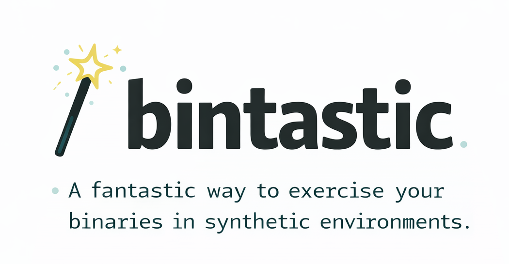

# bintastic


[](https://badge.fury.io/js/bintastic)
[](https://github.com/scalvert/bintastic/blob/master/package.json)

[](#badge)

> **Note:** This package was formerly published as `@scalvert/bin-tester`.

<p align="center">
  
</p>

Testing a CLI isn't like testing a library—you can't just import functions and call them. You need to spawn your CLI as a subprocess, give it real files to work with, and capture its output. `bintastic` simplifies this:

```ts snippet=basic-example.ts
import { createBintastic } from 'bintastic';

describe('my-cli', () => {
  const { setupProject, teardownProject, runBin } = createBintastic({
    binPath: './bin/my-cli.js',
  });

  let project;

  beforeEach(async () => {
    project = await setupProject();
  });

  afterEach(() => {
    teardownProject();
  });

  test('processes files', async () => {
    project.files = { 'input.txt': 'hello' };
    await project.write();

    const result = await runBin('input.txt');

    expect(result.exitCode).toBe(0);
    expect(result.stdout).toContain('processed');
  });
});
```

## Install

```bash
npm add bintastic --save-dev
```

## Usage

`createBintastic` returns helpers for setting up projects, running your CLI, and cleaning up:

```ts snippet=create-bintastic.ts
const { setupProject, teardownProject, runBin } = createBintastic({
  binPath: './bin/my-cli.js',
  staticArgs: ['--verbose'], // args passed to every invocation
});
```

**Setup and teardown:**

```ts snippet=setup-teardown.ts
const project = await setupProject(); // creates temp directory
// ... run tests ...
teardownProject(); // removes temp directory
```

**Writing fixture files:**

```ts snippet=writing-fixtures.ts
project.files = {
  'src/index.js': 'export default 42;',
  'package.json': JSON.stringify({ name: 'test' }),
};
await project.write();
```

**Running your CLI:**

```ts snippet=running-cli.ts
const result = await runBin('--flag', 'arg');

result.exitCode; // number
result.stdout; // string
result.stderr; // string
```

## Debugging

Set `BINTASTIC_DEBUG` to enable the Node inspector and preserve fixtures for inspection:

```bash
BINTASTIC_DEBUG=attach npm test  # attach debugger
BINTASTIC_DEBUG=break npm test   # break on first line
```

Or use `runBinDebug()` programmatically:

```ts snippet=run-bin-debug.ts
await runBinDebug('--flag'); // runs with --inspect
```

For VS Code, add to `.vscode/launch.json`:

```jsonc
{
  "name": "Debug Tests",
  "type": "node",
  "request": "launch",
  "runtimeExecutable": "${workspaceFolder}/node_modules/.bin/vitest",
  "runtimeArgs": ["run"],
  "autoAttachChildProcesses": true,
  "console": "integratedTerminal",
}
```

## API

See the [full API documentation](https://scalvert.github.io/bintastic/).
